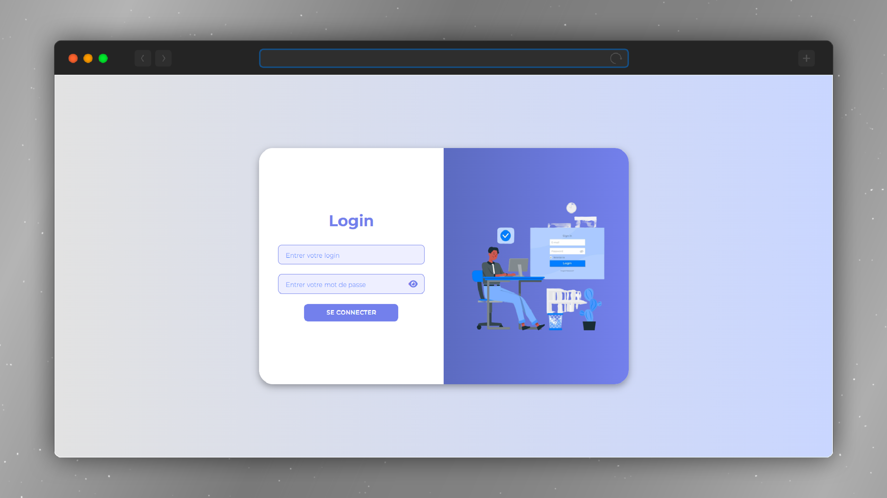
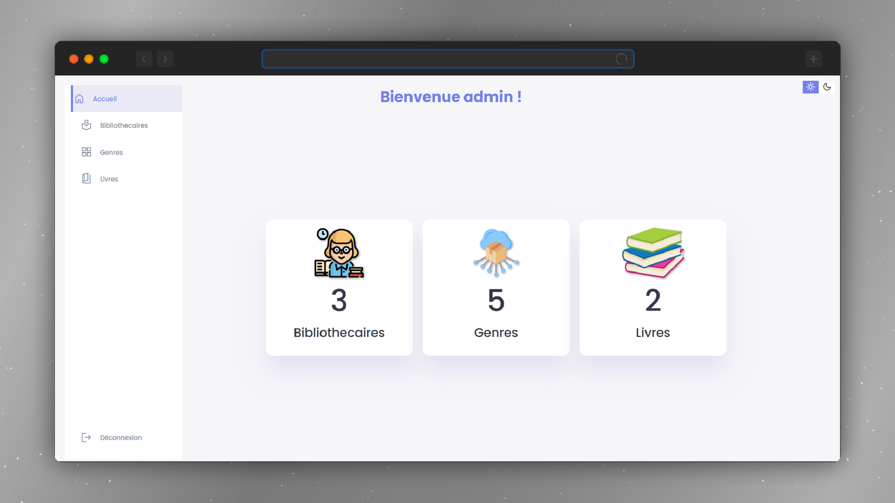
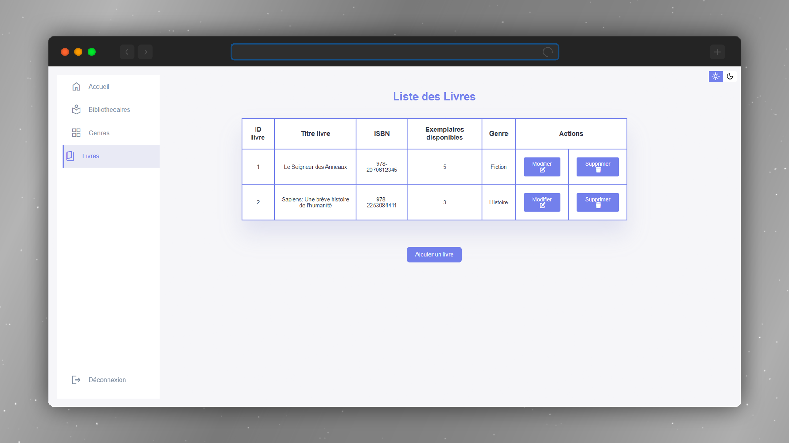
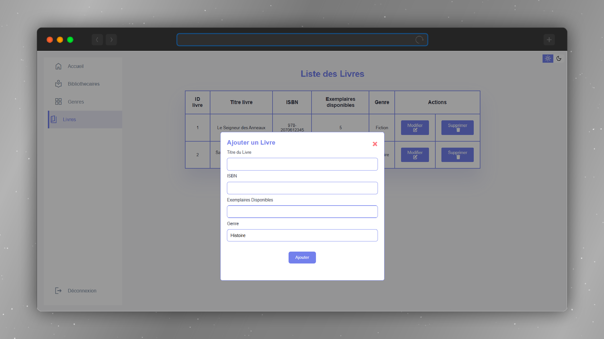

<h1 align="center">
📚 PHP Library Management System
</h1>

<p align="center">
  
  
  
  
  
</p>

<p align="center">
  A simple web-based library management system built with <strong>PHP</strong> and <strong>MySQL</strong>.<br>
  It allows you to manage <strong>books</strong>, <strong>genres</strong>, and <strong>librarians</strong> with full CRUD operations.
</p>

---

## 📁 Project Structure

```bash
📁 library-management-php
    │
    ├── 📁 actions
    │
    ├── 📁 auth
    │
    ├── 📁 classes
    │
    ├── 📁 config
    │
    ├── 📁 db
    │
    ├── 📁 images
    │
    ├── 📁 views


```
---

## 🧰 Tools & Technologies Used

| Layer         | Technology        |
|---------------|-------------------|
| Backend       | PHP  |
| Database      | MySQL             |
| Styling       | HTML, CSS         |
| Tools         | XAMPP, phpMyAdmin |
| Editor        | VS Code           |

---

## 🖼️ Preview







---

## 🚀 Getting Started

To run the project locally:

```bash
# Clone the repository
git clone https://github.com/BenAbdallahAmir/library-management-php.git

# Place the folder inside XAMPP's htdocs directory
cd /xampp/htdocs/

# Start Apache and MySQL via XAMPP control panel
# Then open your browser and navigate to:
http://localhost/library-management-php/
```
---

## 🌐 Catch me on :

[](https://amirbenabdallah.netlify.app)
[](https://www.linkedin.com/in/benabdallahamir)
[](https://github.com/BenAbdallahAmir)
[](https://www.behance.net/aba_artworks)
